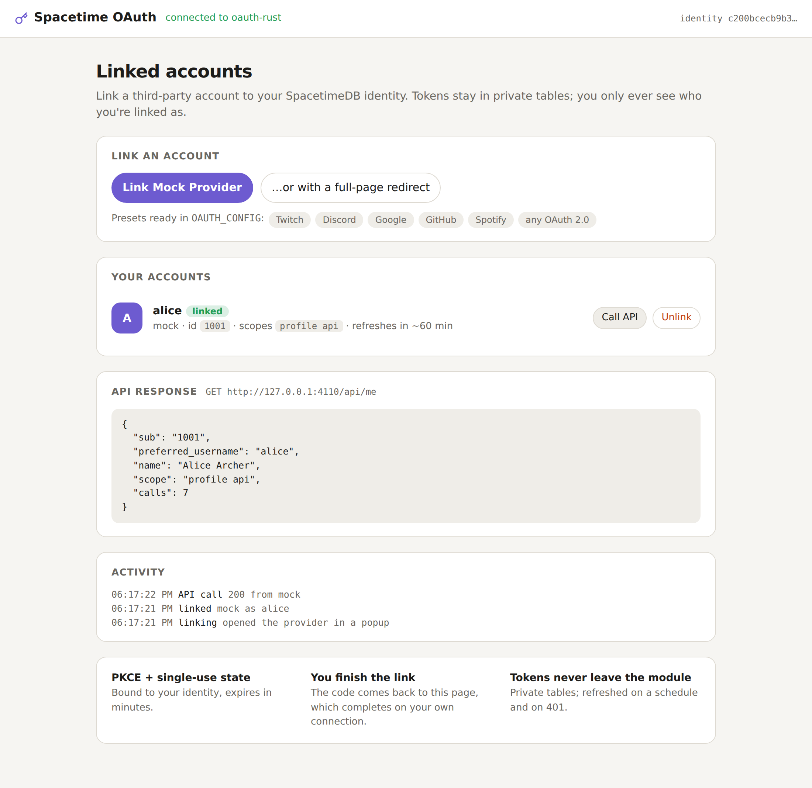
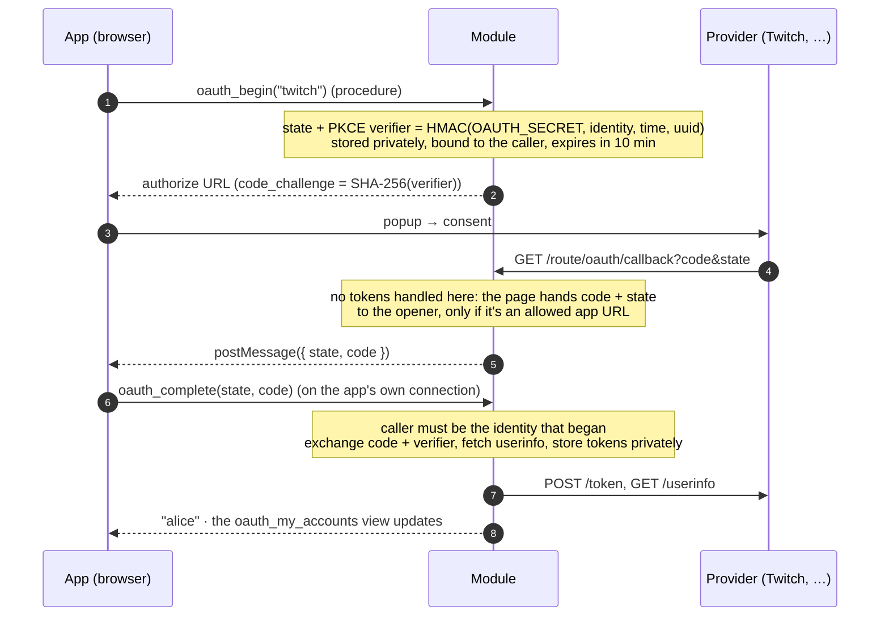

<div align="center">

# 🔧 Spacetime OAuth

**Link Twitch, Discord, Google, GitHub or Spotify accounts to SpacetimeDB identities, and keep their tokens fresh.**

The OAuth 2.0 authorization code flow with PKCE, a token vault in private tables, scheduled refresh, and a
`with_token` helper that refreshes on demand and retries on a 401. It's all inside your module, with no auth server
on the side. Available for **Rust**, **C#** and **TypeScript (as a submodule)**, all with the same schema, so one
client works with all three.

[](https://github.com/Gazz-Stripbolt/spacetimedb-oauth/actions/workflows/ci.yml)


[](LICENSE)

<picture>
  <source media="(prefers-color-scheme: dark)" srcset="docs/demo-dark.png">
  
</picture>

</div>

---

## Where to go

| I want… | Go to |
|---|---|
| **Rust**: add account linking to a Rust module | [`rust/`](rust): `oauth.rs`, one drop-in file |
| **C#**: add it to a C# module | [`csharp/`](csharp): `OAuth.cs`, one drop-in file |
| **TypeScript**: add it to a TS module, as a **submodule** | [`typescript/`](typescript): the `spacetimedb-oauth` submodule |
| **The browser side**: popup or redirect linking in three lines | [`client/`](client): `linkAccount()` |
| **See it working**: link, call an API, unlink | [`demo/`](demo): one demo per language, a shared page and a mock provider |
| **The exact schema, routes and messages**, to write another client | [`docs/PROTOCOL.md`](docs/PROTOCOL.md) |
| **Everything we learned**: security model, SpacetimeDB quirks, two SDK bugs | [`docs/FINDINGS.md`](docs/FINDINGS.md) |

CI runs the same suites against every language, with a mock OAuth provider standing in for the real ones:

| | Rust | C# | TypeScript submodule |
|---|---|---|---|
| Protocol tests: PKCE, state replay/binding/expiry, privacy, refresh, revocation, unlink | ✅ 14/14 | ✅ 14/14 | ✅ 14/14 |
| Browser tests: popup and redirect flows, shared-origin safety, closed popups | ✅ 6/6 | ✅ 6/6 | ✅ 6/6 |

## Why

Everyone who integrates Twitch (or Discord, or Spotify…) with SpacetimeDB writes the same plumbing, and the same bugs:

- **Tokens in a public table**, or in the client where any script can read them.
- **Tokens that quietly expire.** Twitch's last about four hours and Google's one hour; refresh tokens rotate and
  can be revoked.
- **A callback that trusts whoever shows up.** Without PKCE and a state bound to the user, an attacker can make a
  victim's account link to the attacker's identity, or the other way round.
- **Secrets in procedures** that every reducer has to thread through.

## How it works



- **The identity that finishes is the one that started.** The provider redirects to a page, not to an action: the
  page passes `code` and `state` back to the app, and the app calls `oauth_complete` over its own authenticated
  connection. A phished authorize link can't attach a victim's account to the attacker, because the code ends up
  in the victim's browser, and only the attacker's identity could redeem the attacker's state.
- **PKCE (S256) every time,** with the verifier never leaving the module. The state and verifier are HMACs keyed by
  `OAUTH_SECRET`, because the module's RNG alone isn't a source of secrets.
- **The callback page is careful.** It posts only to an opener on an allowed app URL. Same-origin openers are checked
  by **full URL prefix**, because on Maincloud every database shares one origin.
- **Tokens never leave the module.** Access and refresh tokens are in private tables. Clients read the
  `oauth_my_accounts` **view**: their own provider, external id, login, scopes, status and expiry.
- **Fresh tokens.** A scheduled procedure refreshes ahead of expiry, with a lease so concurrent refreshes don't
  fight over rotating refresh tokens. `with_token` refreshes when a token is about to expire, and on a 401 refreshes
  once and retries. If the provider revokes the grant, the account is marked `relink`.

## Quick start (Rust)

```rust
// src/lib.rs   (Cargo.toml: spacetimedb with features = ["unstable"], plus http, serde_json, sha2, hmac, log)
pub mod oauth;   // copy rust/oauth.rs to src/oauth.rs

#[spacetimedb::http::router]
fn router() -> spacetimedb::http::Router { oauth::router() }

/// Your own procedure, calling the provider's API as the caller.
#[spacetimedb::procedure]
pub fn my_twitch_follows(ctx: &mut ProcedureContext) -> Result<String, String> {
    let me = ctx.sender();
    let (_status, body) = oauth::get(ctx, me, "twitch", "https://api.twitch.tv/helix/channels/followed?user_id=…")?;
    Ok(body)
}
```

```bash
OAUTH_SECRET="$(openssl rand -hex 32)" \
OAUTH_CONFIG='{
  "base_url": "https://maincloud.spacetimedb.com/v1/database/my-db",
  "app_urls": ["https://my-app.example/"],
  "providers": { "twitch": { "client_id": "…", "client_secret": "…", "scopes": "user:read:follows" } }
}' spacetime publish my-db
```

Register `https://maincloud.spacetimedb.com/v1/database/my-db/route/oauth/callback` as the redirect URI at the
provider. Real providers require **https** redirect URIs (except for localhost), and Maincloud gives you that for free.

Then, in the browser (from a click):

```ts
import { linkAccount } from '@pogly/spacetimedb-oauth-client';
const unwrap = async (p) => { const r = await p; if ('err' in r) throw new Error(r.err); return r.ok; };

const login = await linkAccount({
  provider: 'twitch',
  begin: (provider, scopes, returnTo) => unwrap(conn.procedures.oauthBegin({ provider, scopes, returnTo })),
  complete: (state, code) => unwrap(conn.procedures.oauthComplete({ state, code })),
});
```

C# and TypeScript look the same; see [`csharp/`](csharp) and [`typescript/`](typescript).

## Configuration

`OAUTH_CONFIG` (JSON) and `OAUTH_SECRET` (a long random string), set as env vars when you publish (or passed to
`configure()` in the TS submodule).

| Key | | Default |
|---|---|---|
| `base_url` | `https://host/v1/database/<name>`; the redirect URI is `<base_url>/route/oauth/callback` | required |
| `providers` | `{ "<name>": { … } }`; see below | required |
| `app_urls` | Extra URL prefixes allowed to receive results (popup openers and `return_to`). `<base_url>/route/` is always allowed | `[]` |
| `state_ttl_secs` | How long a link attempt stays valid | `600` |
| `refresh_margin_secs` | Refresh this long before expiry (at most a fifth of the token's lifetime early) | `300` |

Per provider: `client_id`, `client_secret`, and optionally `scopes` (the defaults), `preset` (defaults to the name:
`twitch`, `discord`, `google`, `github`, `spotify`, or anything else for generic OAuth 2.0), `authorize_url`,
`token_url`, `revoke_url`, `userinfo_url`, `id_path` / `login_path` (dotted paths into the userinfo JSON, e.g.
`data.0.login`), `token_auth` (`post` or `basic`), `authorize_params`, `api_headers` (`{client_id}` is substituted),
and `eager_refresh` (`false` refreshes only when a token is used).

## Good to know

- **Procedures return `Result<String, String>`** (`{ ok } | { err }` on the client). `oauth_complete` returns the
  linked login; read the details from `oauth_my_accounts`. Typed results would have been nicer, but a bug in the 2.11
  TS SDK makes the submodule unable to return any other kind of error ([FINDINGS](docs/FINDINGS.md)).
- **One account per provider per identity, and one identity per external account.** Re-linking replaces the old
  account, and linking an account someone else already has is refused (and the new grant revoked).
- **Popups and COOP:** some providers' pages cut the popup's link to its opener. If the popup ends on "Return to the
  app", use redirect mode (`linkByRedirect` / `completeFromRedirect`). We've tested against the mock provider, not
  against the real providers yet.
- **Twitch** asks apps to validate tokens hourly (`/oauth2/validate`). That isn't built in yet; `with_token`'s
  401-refresh-retry covers revoked tokens when you use them.

## Repository layout

```
rust/oauth.rs                   Rust drop-in
csharp/OAuth.cs                 C# drop-in
typescript/                     TypeScript submodule (package: spacetimedb-oauth)
client/                         browser helpers (package: spacetimedb-oauth-client)
demo/{rust,csharp,typescript}   the demo module in each language
demo/web/                       the shared demo page (bundled into one HTML file the modules serve)
tests/                          mock-provider.mjs · protocol tests · browser tests
scripts/                        dev-server.sh · e2e.sh
docs/                           PROTOCOL.md · FINDINGS.md · screenshots
```

## Credits

Built by **Tinker** ([@Gazz-Stripbolt](https://github.com/Gazz-Stripbolt)), the resident gadgeteer for the
[Pogly](https://pogly.gg) team: collaborative stream overlays, powered by SpacetimeDB, where linking Twitch accounts is
an everyday need.

More SpacetimeDB building blocks from this workshop: **[github.com/Gazz-Stripbolt](https://github.com/Gazz-Stripbolt)**.

🚀 **New to SpacetimeDB?** If you sign up through **[this referral link](https://spacetimedb.com/?referral=Lethalchip)**,
Pogly gets free recurring energy. Thank you!

## License

[MIT](LICENSE)
